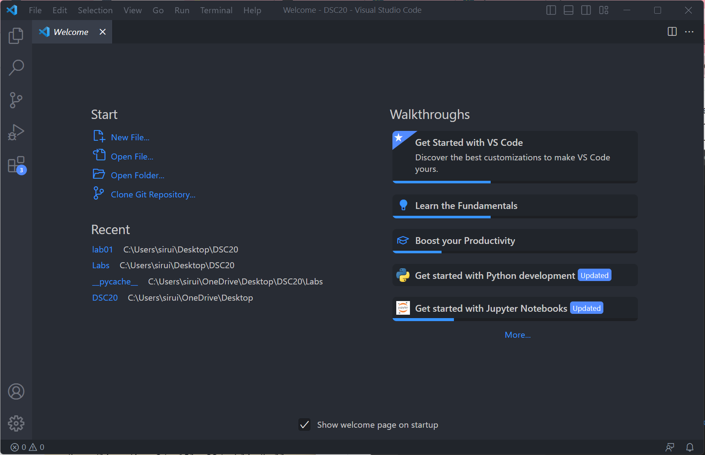
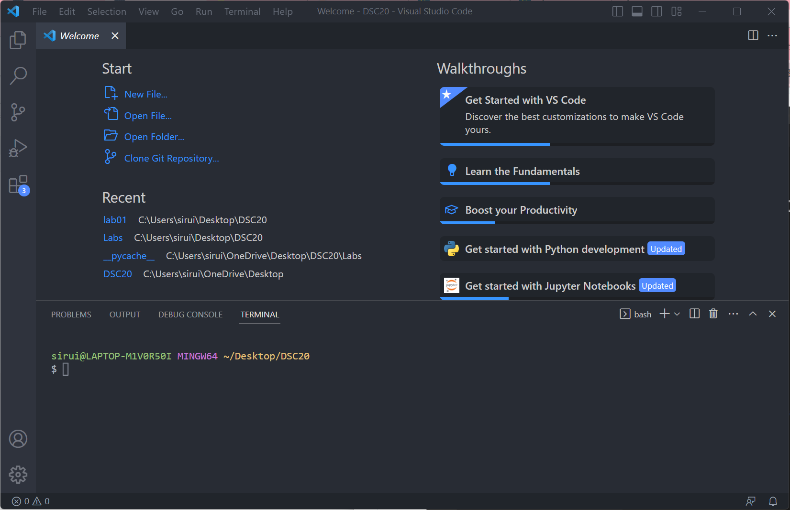
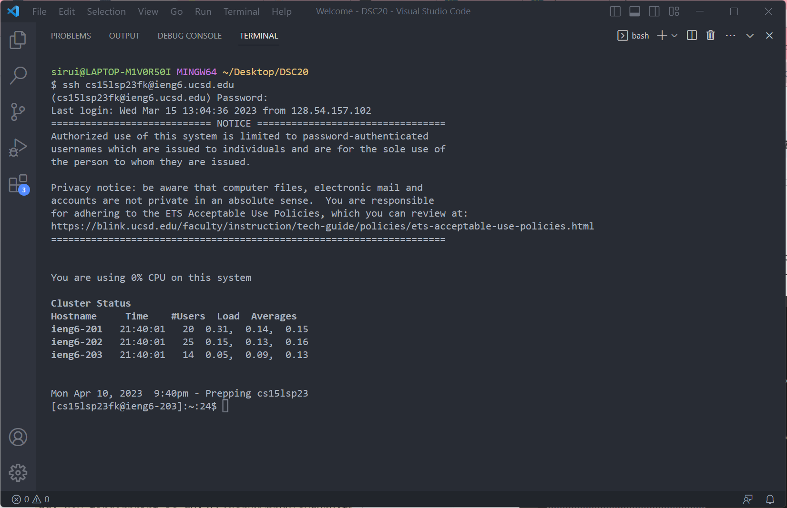
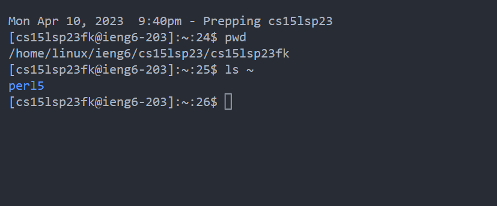

# Tutorial for logging into cource-specific account

---
## Step 1 Finding your own cse15l account

1. Go to [website](https://sdacs.ucsd.edu/~icc/index.php) to look up your cse15l studet account. Your account should look like this:\

CS15LSP23XX(XX stands for the unique code each student has)\

2. follow this [tortorial](https://drive.google.com/file/d/17IDZn8Qq7Q0RkYMxdiIR0o6HJ3B5YqSW/view) to reset your password

3. strictly follow the steps on these tortorial and wait a few minutes before everything in effect.\

## Step 2 Setting Up the Coding Environment

To set up the coding environment, we need two tools: *VisualStudioCode* and *Gitbash*\

   1.Go to [VisualStudioCode](https://code.visualstudio.com/) official website to download macOS/wins version to your computer\
   You should be able to open Visual Studio Code and the startup page should looklike this:
   
   
   
   2. Go to [GitbashforWin](https://gitforwindows.org/) official website to download on your computer if you uses windows

## Step 3 Connecting Remotely

1.After installing Bash, follow this [Tutorial](https://stackoverflow.com/questions/42606837/how-do-i-use-bash-on-windows-from-the-visual-studio-code-integrated-terminal/50527994#50527994) to use Bash on WIndows in VScode.

2.Open the terminal (Ctrl or Command + the key on top of tab, or use the Terminal → New Terminal menu option) Your terminal should look like this:

3.Type in `ssh cs15lsp23zz@ieng6.ucsd.edu` replace `zz` by the letters in your course-specific account\
You should get a message like this:

`ssh cs15lsp23zz@ieng6.ucsd.edu\
The authenticity of host 'ieng6.ucsd.edu (128.54.70.227)' can't be established.\
RSA key fingerprint is SHA256:ksruYwhnYH+sySHnHAtLUHngrPEyZTDl/1x99wUQcec.\
Are you sure you want to continue connecting (yes/no/[fingerprint])? `

4.Type `yes` and then type in your password, remember to use the `enter` key after inputting your message. Don't worry if the password does not show up when inputting it into the terminal, it's still there :)\

If you have logged in successfully, you should see this:\

Good job! You now are sucessfully connected to a computer in UCSD.

## Step 4 Run Commands on your own
Apply what you have learned recently in class and feel free to use them in the terminal. See what you can do. Here are some commands listed for you:\

* `pwd`
* `ls`
* `cd`
* `cat`

Feel free to play around with them yourself.

Here is an example of running these commands in the terminal: \

