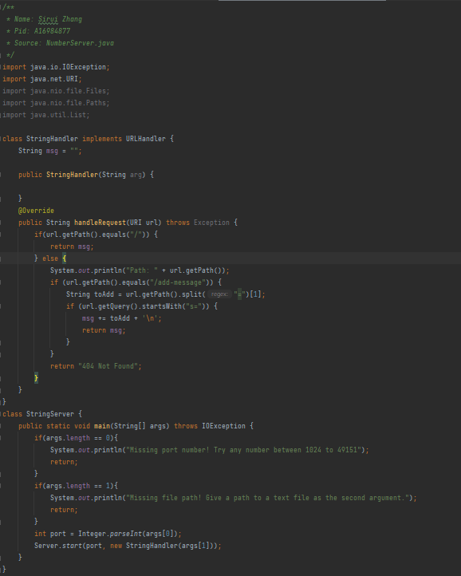
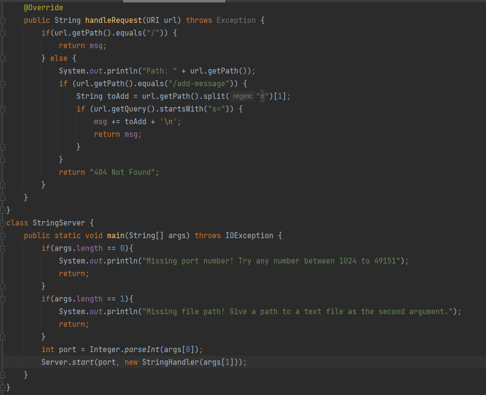
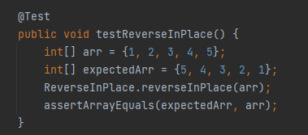

# Lab report 2

---
## Part 1

The web server `StringServer`, supports the path and behavior by keep track of a single string that gets added to by incoming requests.\
In both cases, the handleRequest method of the StringHandler class is called.\

For the first screenshot, the relevant argument is URI url with the value http://localhost:8080/add-message?s=Hello. The msg field of the StringHandler class changes from an empty string to "Hello\n".\

For the second screenshot, the relevant argument is URI url with the value http://localhost:8080/add-message?s=How are you. The msg field of the StringHandler class changes from "Hello\n" to "Hello\n How are you\n".

## Part 2
Here's the bug I chose from lab 3\
`static void reverseInPlace(int[] arr) {`\
`    for(int i = 0; i < arr.length; i += 1) {`\
`        arr[i] = arr[arr.length - i - 1];`\
`     }`\
 ` }`
 
An input that doesn’t induce a failure, as a JUnit test and any associated code is the following\

The symptom, as the output of running the tests\

The bug in this code is that instead of reversing the array, this code just copies the array elements in reverse order, resulting in an array with all elements having the same value as the last element of the original array, different than expected output.\

## Part 3
Some of the things that I have learned from lab2 and 3 is how to make a web Server that takes care of the input given in from the urls. 
