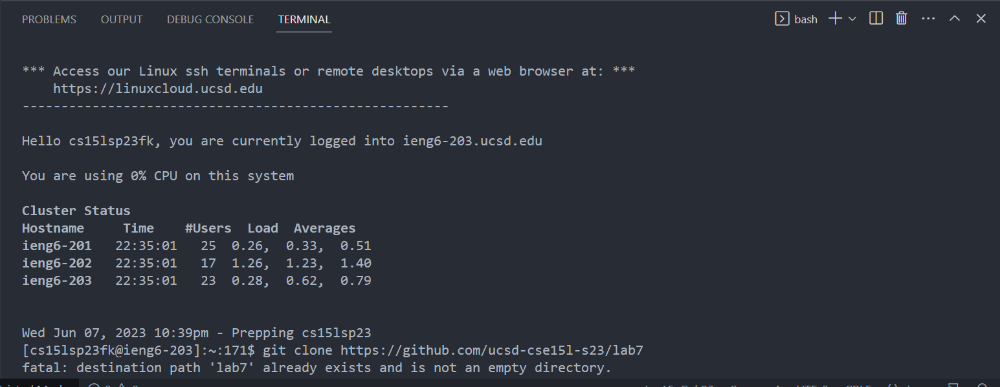
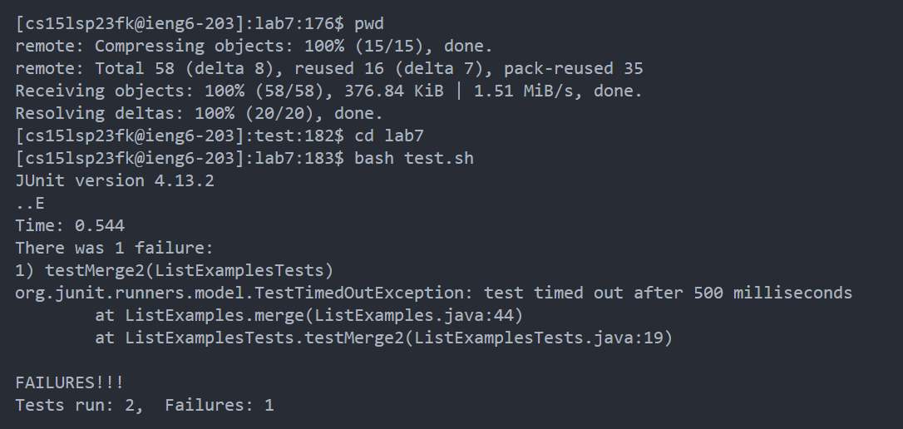
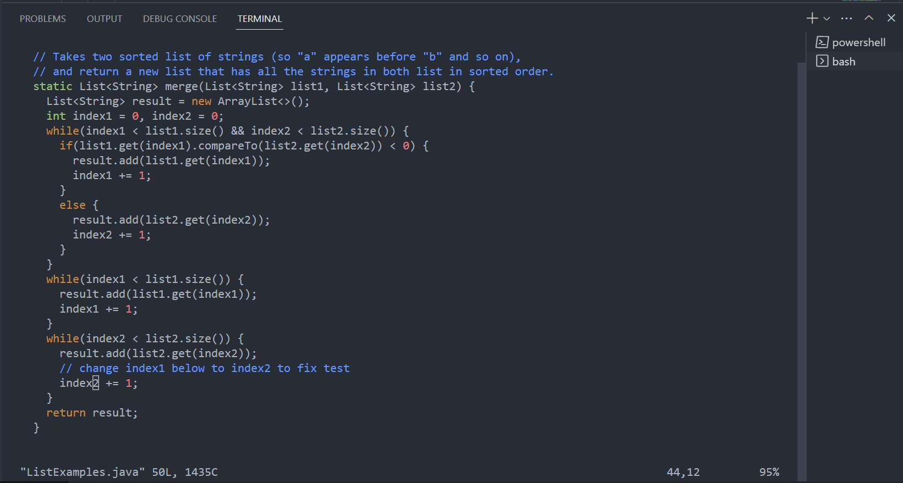
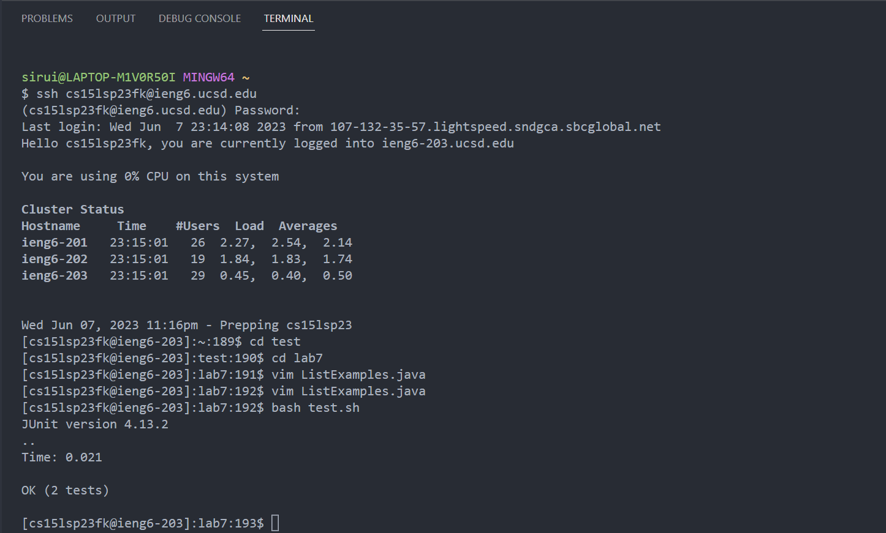
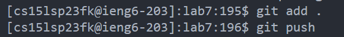

# Lab report 4

---
## Steps to take and key pressed

4. I started from logging into my account and clone from the link provided.

5. clone the repository

6. move to the file that contains the file `lab7` and run the test

key pressed: `<cd lab7> <enter> <bash test.sh> <enter>`

7.Fix the error using vim
key pressed:   

`<vim ListExamples.java>` \
`to get to the bottom of the file <j> <j> <j> <j> <j>` \
`move up to the line that contains the code we want to change<k> <k> <k> <k> <k> <k>`   
`move the corsor to '1' <l> <l> <l> <l> <l> <l> <l> <l> <l> <l> <l>`   
`delete '1' <X>` \
`open insert mode<A>` \
`insert 2 <2>` \
`exit insert mode <Esc>` \
`exit vim with saving<:wq>` 
   

8. Run the test again to see if the tests have been passed \
key pressed: `<bash test.sh> <enter>` 

9. `Push the changes to github: <git add .> <enter> <git push> <enter>`

