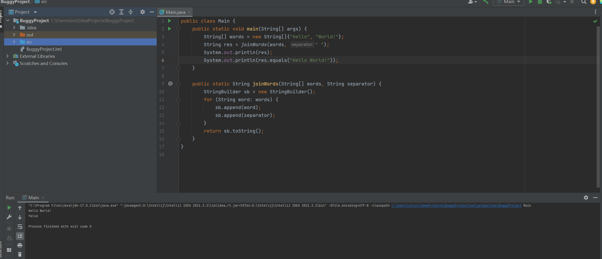
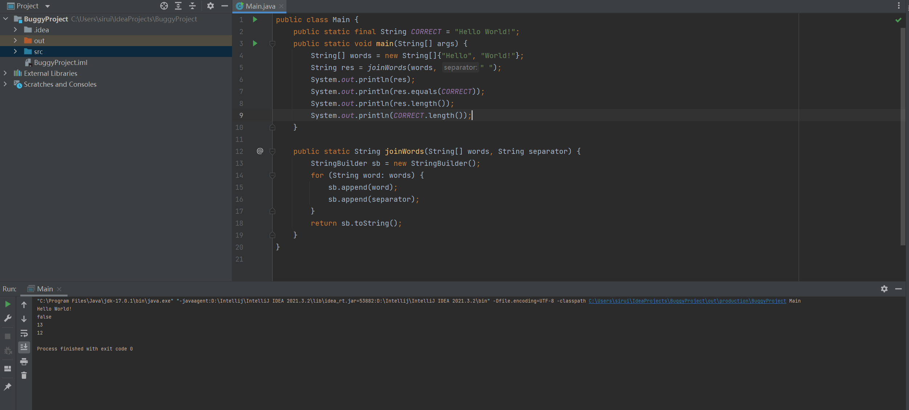
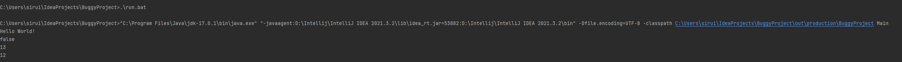

# Lab report 5

---
## Part 1
Student: my test failed but i dont see the difference from the output,

ta: you should add intermediate command such as printing out the length of the string making sure you obtained your desired output. And then compare the length.

## Part 2
Reflection: One of the most important thing I have learned in the second half of the quarter is I learned a lot of useful commands through bash and terminals. How to properly identify bugs, symptons in a file and using bash to identify them. They are all useful skills in my learning of programming languages, and I will keep practicing these skills through out my learning in other cources.
